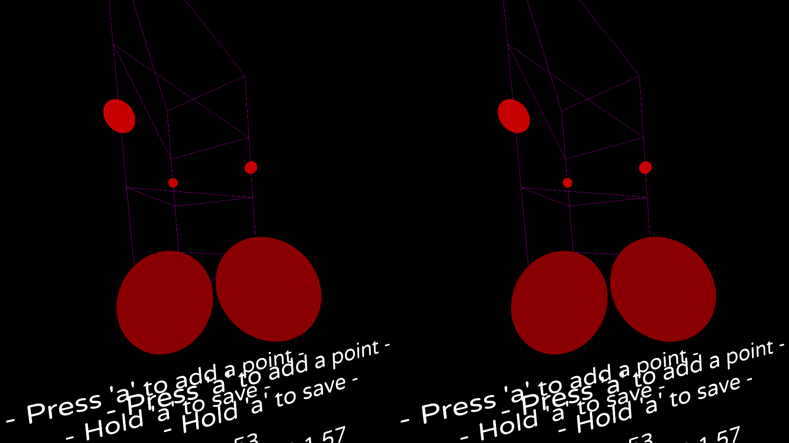

# lovr-playspace
Room boundary overlay for OpenXR, made with LÖVR.

[](assets/preview.png)

## Prerequisites
- **LÖVR:** If your distro has no package for it, I recommend [their releases](https://github.com/bjornbytes/lovr/releases).
- **git:** Recommended for pulling this project.

## How to run
```
git clone "https://github.com/SpookySkeletons/lovr-playspace"
./lovr-*.AppImage lovr-playspace
```

## How to use
Press `action_button` (`trigger` by default) to set points. Hold `action_button` to save the points. This will end edit mode. If you want to get back into edit mode, hold `action_button` while the program starts, or delete `config/points.json`. Other settings have to be configured with a text editor, see below.

## Configuration
Settings are stored separated in the program directory, in `config/`.
- `action_button.txt`: The button to use to do actions like placing points. [See the LÖVR documentation](https://lovr.org/docs/v0.17.0/DeviceButton).
- `color_close_corners.json`: How to color the points you've set when they're close. Borders of edges of your defined shape, as well as your grid\_top/grid\_bottom.
- `color_close_grid.json`: How to color the lines between the corners when close.
- `color_close_corners.json`: How to color the points you've set when they're far.
- `color_close_grid.json`: How to color the lines between the corners when far.
- `fade_start.txt`: What is considered far away from a wall, in meters. Affects how colors fade.
- `fade_start.txt`: What is considered close to a wall, in meters. Affects how colors fade.
- `grid_bottom.txt`: Where to start drawing lines from, relative to your ground.
- `grid_density.txt`: How much to divide your lines for drawing a grid into it, in meters.
- `grid_top.txt`: Where to stop drawing lines, relative to your ground.
- `points.json`: The points you've set. Does not exist by default.
